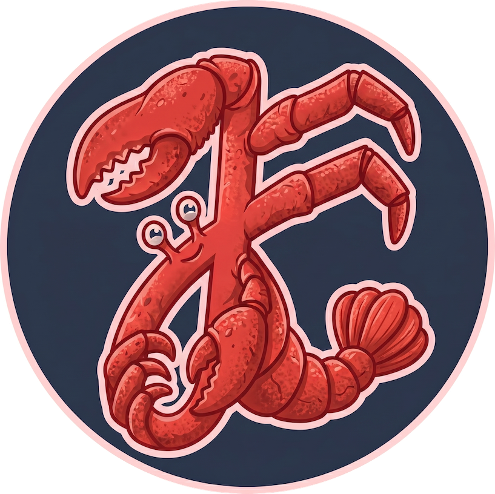

<a href="https://github.com/jufty-bot">
    

    
    

</a>

# jufty-bot 🦞

jufty-bot is [@juftin](https://github.com/juftin)'s lobster. He takes a few forms:

- A remote Claude Code, Codex, Antigravity, or OpenCode session.
- An OpenClaw or Hermes companion.
- Maybe something even more fun and exotic.

Different tools, same lobster. Always with a human-in-the-loop.
